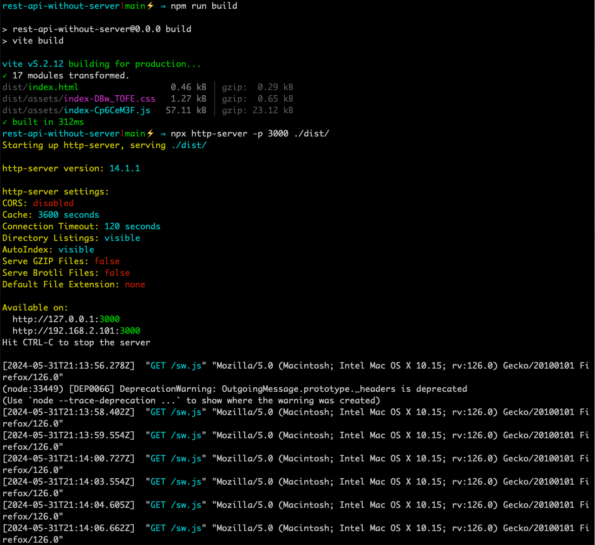
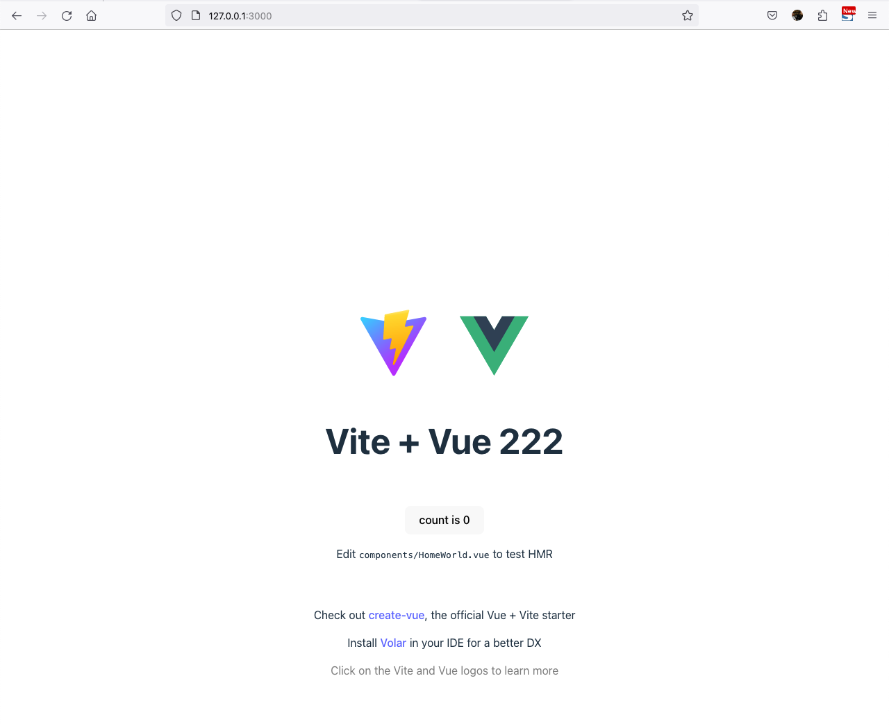
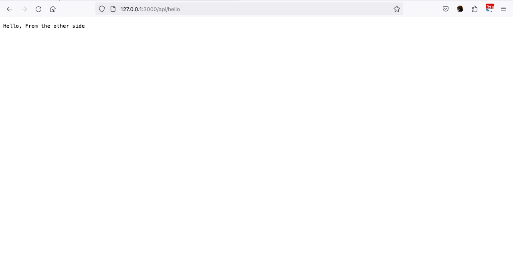

# Vue 3 + Vite + REST API

This repo is demonstration of the article from [REST API Without Server](https://www.freecodecamp.org/news/how-to-create-a-rest-api-without-a-server/).

## How to run

```
npm run build
npx http-server -p 3000 ./dist/ => to start the app + the rest api server
```

And then navigate to the link provide
- http://127.0.0.1:3000 => Leads you to the root of the project
- http://127.0.0.1:3000/api/hello => You can access the API





